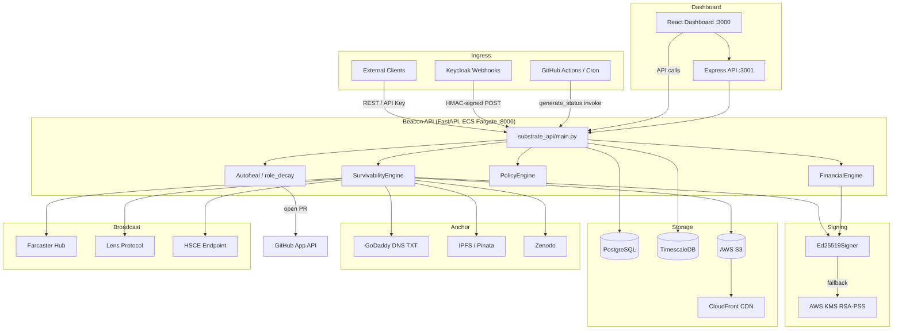
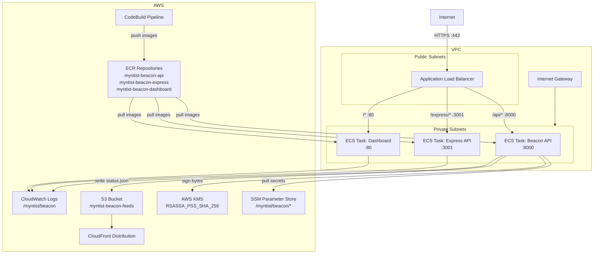
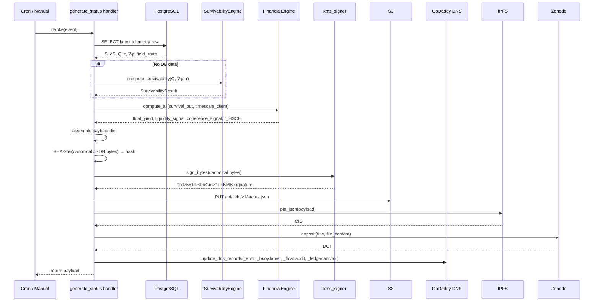
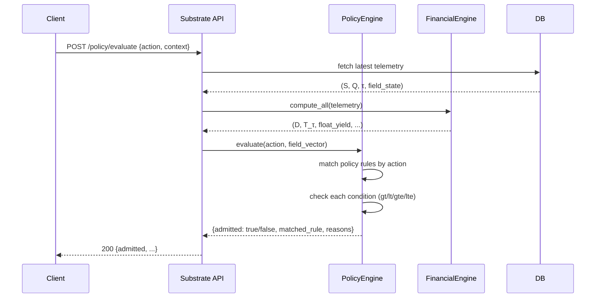

# Architecture

## System Context

```
┌──────────────────────────────────────────────────────────────────────┐
│ External World                                                        │
│                                                                       │
│  Keycloak ──webhook──►  Substrate API  ◄─── REST clients             │
│  GitHub Actions ────►                                                 │
│  Cron/Lambda ──────►                                                  │
└──────────────────────────────────────────────────────────────────────┘
                            │
                  ┌─────────┼──────────┐
                  ▼         ▼          ▼
            PostgreSQL  TimescaleDB  AWS S3
                  │
        ┌─────────┴──────────┐
        ▼                    ▼
  SurvivabilityEngine   FinancialEngine
        │                    │
        └─────────┬──────────┘
                  ▼
          generate_status (Lambda)
                  │
        ┌─────────┼─────────┬──────────┐
        ▼         ▼         ▼          ▼
    S3/CloudFront  GoDaddy DNS  IPFS/Pinata  Zenodo
    (status.json)  (TXT records)  (CID)      (DOI)
```

---

## Mermaid — Full System Diagram



---

## AWS Infrastructure



---

## Data Flow — Status.json Generation



---

## IAM Policy Evaluation Flow



---

## Signing Architecture

```
ED25519_PRIVATE_KEY_HEX ──► Ed25519PrivateKey.from_private_bytes()
                                     │
                                     ▼
                           .sign(canonical_bytes)
                                     │
                                     ▼
                         "ed25519:<base64url>"   ──► status.json["signature"]

                              FALLBACK PATH
KMS_KEY_ID (real ARN) ──► boto3.client("kms").sign(
                              KeyId, Message, MessageType="RAW",
                              SigningAlgorithm="RSASSA_PSS_SHA_256"
                          )
                                     │
                                     ▼
                         base64(signature_bytes)  ──► status.json["signature"]

Note: KMS_KEY_ID set to an alias/ prefix is intentionally disabled.
      Only a concrete key ARN or key UUID activates KMS signing.
```

---

## Local Service Ports

| Port | Service |
|---|---|
| 5432 | PostgreSQL (primary) |
| 5433 | TimescaleDB |
| 8000 | FastAPI Substrate API |
| 3000 | React Dashboard |
| 3001 | Express API (when running) |

---

## Module Dependency Map

```
generate_status/handler.py
    ├── beacon_core.telemetry.survivability_engine
    ├── beacon_core.telemetry.financial_engine
    ├── beacon_core.telemetry.financial_validator
    ├── beacon_core.telemetry.telemetry_exporter
    ├── beacon_core.signing.kms_signer
    │       └── beacon_core.signing.ed25519_signer
    ├── beacon_core.dns.godaddy_updater
    ├── identity_loop.zenodo.ipfs_pinner
    └── identity_loop.zenodo.zenodo_client

substrate_api/main.py
    ├── iam_substrate.substrate_api.policy_engine
    ├── iam_substrate.substrate_api.role_decay   (autoheal)
    ├── beacon_core.signing.ed25519_signer
    ├── beacon_core.signing.field_signing_keys
    └── beacon_core.hsce.*
```
